# clawd-pet-statusline

<p align="center"></p>

<p align="center"><sub>example with made-up data</sub></p>

**Version:** 0.1.0 · see the [CHANGELOG](CHANGELOG.md).

**Clawd**, the little orange Claude Code crab, living animated in the band right above the
message box of the app, next to a **statusline** that updates itself (folder, model, context,
usage limits and the weather where you are).

He reacts to what is going on: he grabs the laptop when you send a message, puts on glasses
when Claude reads files, sweats when the context fills up, opens an umbrella when it rains in
your city, sets off fireworks on `git commit`... The full list is in the [sheet](#the-sheet-what-each-animation-means).

> Fan project, **unofficial**, not affiliated with Anthropic. "Claude", "Claude Code" and
> Clawd belong to Anthropic. The pixel drawings and the laptop animation in this repository
> were made for him.

*[Português abaixo](#português)*

> **Tested only on Windows 11, with app version 2.1.288.** The code finds your user folder in
> a portable way (`~/.claude`), but nobody has run it on macOS or Linux yet. If you try it
> there, please [open an issue](https://github.com/gusthanks/clawd-pet-statusline/issues)
> telling us whether it worked, with your system and app version.

---

## The sheet: what each animation means

The images below are generated straight from the code (`tools/make-sheet.py`), so they are
exactly what you see in the app.

### Everyday

| | What you see | When it happens |
|---|---|---|
|  | **Strolling** | Nothing going on: he walks along the track and looks around. |
|  | **Message in** | You sent a message: he waves, runs to the corner, grabs the laptop and opens it. |
|  | **Celebrating** | The reply finished fine: he puts the laptop away and jumps with confetti. |
|  | **Startled** | The turn ended with an error. |
|  | **Sleeping** | 10 idle minutes (3 at night). A tap wakes him up. |

### Working (the accessory shows what Claude is doing)

| | What you see | When it happens |
|---|---|---|
|  | **Glasses** | Reading files (Read, Grep, Glob). |
|  | **Magnifier** | Searching the web (WebSearch, WebFetch, browser). |
|  | **Little hammer** | Editing files (Edit, Write). |
|  | **Mini-Clawds** | One per running subagent, each on its own laptop (up to 6; then a "+N" shows up). |
|  | **Purple aura + light streak** | Ultracode mode, or a workflow running in the background. |
|  | **Press** | Claude is compacting the conversation context. |
|  | **Fireworks** | Right after a successful `git commit` or `git push`. |

### Warnings (he reads the statusline)

| | What you see | When it happens |
|---|---|---|
|  | **Sweating** | The context is above 80%. |
|  | **Worried** (eyebrows + "!" bubble) | The 5-hour limit is above 90%. |
|  | **"pausa?"** (break?) | One hour of non-stop work: he stretches and suggests a break. |
|  | **Calling you** (waving + "?" bubble) | Claude is waiting for your permission: he puts the laptop away and waves until you answer (or 10 minutes pass). |

### Time and weather

| | What you see | When it happens |
|---|---|---|
|  | **Coffee** | From 6am to 11am, idle. |
|  | **Small hours** | From midnight to 5am: he yawns and falls asleep sooner, and the lane gets a small crescent moon and a few twinkling stars (the stars go away if it's raining, the moon stays). |
|  | **Umbrella** | It is raining where you are: he wears the umbrella on his head and the track gets rain. |
|  | **Big umbrella** | Raining and working: it covers him and the laptop. |
|  | **Dates** | A red Christmas hat on Dec 24 and 25; a colorful party hat with light confetti on Dec 31, Jan 1 and on your birthday (set it with `CLAWD_BIRTHDAY`). When it rains the umbrella wins and the hat goes away. |

### Playing with him

| | What you see | When it happens |
|---|---|---|
|  | **Tap** | Click him: he flattens and pops out a star. |
|  | **Dizzy** | Four taps in 3 seconds: spinning eyes and little stars. |

---

## The statusline

In the same band, to the left of Clawd:

- 📂 the conversation's folder, with lines changed (`+12 -3`) and the current weather (☁️ 22°);
- 🌀 the model, the effort (MEDIUM, HIGH, MAX...) and how much of the context is used;
- ⏳ and 📅 the 5-hour and 7-day usage limits, with the time until they renew.

It updates itself: every 20 seconds, and the moment something changes. The limits come
straight from your account, like the usage panel in the app.

---

## Install

**You need:** the Claude Code app (Code tab, on desktop) in a version with mod support
(tested on 2.1.288) and [Node.js](https://nodejs.org) 18 or newer.

```bash
git clone https://github.com/gusthanks/clawd-pet-statusline.git
cd clawd-pet-statusline
node install.mjs
```

Then **open a new conversation** in the app. Conversations that were already open stay as they were.

The installer:
1. copies the `clawd/` folder to `~/.claude/mods/clawd` (a previous version becomes `.bak-<date>`);
2. copies the statusline to `~/.claude/statusline-rgb.js`, if you don't have one there yet;
3. backs up your `~/.claude/settings.json` and adds one line:

```json
"env": { "CLAUDE_CODE_PLUGIN_DIRS": "~/.claude/mods/clawd" }
```

The `settings.json` lives in `.claude` inside your user folder: `~/.claude/settings.json` on
macOS and Linux, `C:\Users\<you>\.claude\settings.json` on Windows. The installer writes the
full path of your own machine there (on Windows, something like `C:/Users/<you>/.claude/mods/clawd`).

**To turn it off:** `node install.mjs --uninstall` (removes only that line; the files stay).

**To update:** `git pull` and run `node install.mjs` again.

### Optional tweaks (variables in the `env` of settings.json)

More variables are coming soon. Each row below is one variable, so adding one is just adding a row.

| Variable | What it does |
|---|---|
| `CLAWD_LOCATION` | Pins the weather location, for example `"-23.55,-46.63"`. Without it, the place comes from your internet connection. |
| `CLAWD_BIRTHDAY` | Your birthday as `"DD-MM"`, for example `"06-10"`: on that day Clawd wears the party hat. Nothing is sent anywhere; it only compares with the local date. |
| `CLAWD_STATUSLINE` | Uses another statusline script instead of `~/.claude/statusline-rgb.js`. |
| `CLAWD_NODE` | Full path of the Node executable that runs the statusline, e.g. `"C:/Program Files/nodejs/node.exe"`. Without it, the mod tries `node` from the PATH, then (on Windows) whatever `where node` finds, then the usual Mac/Linux paths. |
| `CLAWD_DEBUG` | Any value turns it on: saves a log of your clicks in `~/.claude/plugins/store/clawd_inline-*.json`, to help report problems. |
| `CLAWD_WEATHER` | `off` (or `0`, `false`) turns the weather off: no IP lookup and no Open-Meteo request. The statusline shows no weather, and Clawd never opens the umbrella or makes it rain on the lane. |
| `CLAWD_LIMITS` | `off` (or `0`, `false`) turns off the api.anthropic.com request. The statusline keeps only what the app itself reports with each reply, and Clawd does not get "worried" about the limit. |

If the band is narrow, the statusline switches to the compact format. To force compact
always, create the empty file `~/.claude/statusline-narrow`.

---

## Privacy: who the mod talks to

| Service | What is sent | What for | How often | How to turn off |
|---|---|---|---|---|
| [get.geojs.io](https://www.geojs.io) (backup: [ipwho.is](https://ipwho.is)) | your IP (sent automatically with any request) | finding your city, for the weather | once an hour | `CLAWD_WEATHER=off` (or pin the place with `CLAWD_LOCATION`) |
| [Open-Meteo](https://open-meteo.com) | rounded latitude and longitude | the weather and the time zone | every 15 min | `CLAWD_WEATHER=off` |
| api.anthropic.com | your own Claude login | the statusline usage limits | every 2 min | `CLAWD_LIMITS=off` |

Nothing else leaves your machine, and nothing is stored outside it. With `CLAWD_LOCATION`,
the IP lookup does not happen. To keep the mod off the internet entirely, put
`CLAWD_WEATHER=off` and `CLAWD_LIMITS=off` in the `env` of settings.json.

---

## In the terminal

The mod also loads in the terminal `claude`, but there you only get the orange block logo
above the prompt, because the terminal can't draw the animations. In automatic commands
(`claude -p`) he stays still and costs nothing.

---

## For tinkerers

The file tree is in the [Portuguese section](#para-quem-quer-mexer) below. The commands are the same:

```bash
cd clawd/..                         # the folder that contains clawd/
claude plugin validate ./clawd      # checks the mod
claude plugin test ./clawd          # runs the tests
python tools/make-sheet.py          # rebuilds the sheet
```

License: [MIT](LICENSE).

---

## Português

**Versão:** 0.1.0 · veja o [CHANGELOG](CHANGELOG.md).

O **Clawd**, o caranguejinho laranja do Claude Code, morando animado na faixa logo acima da
caixa de mensagem do app, ao lado de uma **statusline** que se atualiza sozinha (pasta,
modelo, contexto, limites de uso e o clima de onde você está).

Ele reage ao que está acontecendo: pega o laptop quando você manda mensagem, põe óculos
quando o Claude lê arquivos, sua quando o contexto enche, abre o guarda-chuva quando chove
na sua cidade, solta fogos no `git commit`... A lista completa está na [sheet](#a-sheet-o-que-cada-animação-quer-dizer).

> Projeto de fã, **não oficial**, sem ligação com a Anthropic. "Claude", "Claude Code" e o
> Clawd são da Anthropic. Os desenhos em pixel e a animação do laptop deste repositório
> foram feitos para ele.

> **Testado só no Windows 11, com o app na versão 2.1.288.** O código acha a sua pasta de
> usuário de forma portátil (`~/.claude`), mas ninguém rodou no Mac nem no Linux ainda. Se você
> testar por lá, por favor [abra uma issue](https://github.com/gusthanks/clawd-pet-statusline/issues)
> contando se funcionou, com o seu sistema e a versão do app.

---

## A sheet: o que cada animação quer dizer

As imagens abaixo são geradas direto do código (`tools/make-sheet.py`), então são exatamente
o que aparece no app.

### O dia a dia

| | O que você vê | Quando acontece |
|---|---|---|
|  | **Passeando** | Nada acontecendo: ele anda pela pista e olha em volta. |
|  | **Chegou mensagem** | Você enviou uma mensagem: ele acena, corre pro canto, pega o laptop e abre. |
|  | **Comemorando** | A resposta terminou bem: guarda o laptop e pula com confete. |
|  | **Susto** | O turno terminou com erro. |
|  | **Dormindo** | 10 minutos sem nada (3 de madrugada). Um tapinha acorda. |

### Trabalhando (o acessório mostra o que o Claude está fazendo)

| | O que você vê | Quando acontece |
|---|---|---|
|  | **Óculos** | Lendo arquivos (Read, Grep, Glob). |
|  | **Lupa** | Pesquisando na web (WebSearch, WebFetch, navegador). |
|  | **Martelinho** | Editando arquivos (Edit, Write). |
|  | **Mini-Clawds** | Um por subagente rodando, cada um no seu laptop (até 6; depois aparece "+N"). |
|  | **Aura roxa + faixa de luz** | Modo ultracode, ou um workflow rodando em segundo plano. |
|  | **Prensa** | O Claude está compactando o contexto da conversa. |
|  | **Fogos** | Logo depois de um `git commit` ou `git push` que deu certo. |

### Avisos (ele lê a statusline)

| | O que você vê | Quando acontece |
|---|---|---|
|  | **Suando** | O contexto passou de 80%. |
|  | **Preocupado** (sobrancelhas + balão "!") | O limite de 5 horas passou de 90%. |
|  | **"pausa?"** | Uma hora de trabalho sem parar: ele se espreguiça e sugere uma pausa. |
|  | **Chamando você** (acenando + balão "?") | O Claude está esperando a sua permissão: ele guarda o laptop e acena até você responder (ou até passarem 10 minutos). |

### Hora e clima

| | O que você vê | Quando acontece |
|---|---|---|
|  | **Cafezinho** | Das 6h às 11h, parado. |
|  | **Madrugada** | Das 0h às 5h: boceja e dorme mais cedo, e a pista ganha uma lua minguante e poucas estrelas piscando (com chuva as estrelas somem, a lua fica). |
|  | **Guarda-chuva** | Está chovendo onde você está: ele usa o guarda-chuva na cabeça e a pista ganha chuva. |
|  | **Guarda-chuva grande** | Chovendo e trabalhando: cobre ele e o laptop. |
|  | **Datas** | Gorro vermelho de Natal em 24 e 25/12; chapéu de festa colorido, com um confete leve, em 31/12, 1/1 e no seu aniversário (defina com `CLAWD_BIRTHDAY`). Se chove, o guarda-chuva ganha e o chapéu some. |

### Brincando com ele

| | O que você vê | Quando acontece |
|---|---|---|
|  | **Tapinha** | Clique nele: ele achata e solta uma estrela. |
|  | **Tonto** | Quatro tapinhas em 3 segundos: olhos girando e estrelinhas. |

---

## A statusline

Na mesma faixa, à esquerda do Clawd:

- 📂 a pasta da conversa, com as linhas mexidas (`+12 -3`) e o clima de agora (☁️ 22°);
- 🌀 o modelo, o esforço (MEDIUM, HIGH, MAX...) e quanto do contexto já foi usado;
- ⏳ e 📅 os limites de uso de 5 horas e de 7 dias, com o tempo até renovar.

Ela se atualiza sozinha: a cada 20 segundos, e na hora em que algo muda. Os limites vêm
direto da sua conta, como no painel de uso do app.

---

## Instalação

**Você precisa de:** o app do Claude Code (aba Code, no desktop) numa versão com mods
(testado na 2.1.288) e o [Node.js](https://nodejs.org) 18 ou mais novo.

```bash
git clone https://github.com/gusthanks/clawd-pet-statusline.git
cd clawd-pet-statusline
node install.mjs
```

Depois, **abra uma conversa nova** no app. As conversas que já estavam abertas continuam como estavam.

O instalador:
1. copia a pasta `clawd/` para `~/.claude/mods/clawd` (uma versão anterior vira `.bak-<data>`);
2. copia a statusline para `~/.claude/statusline-rgb.js`, se você ainda não tiver uma lá;
3. guarda uma cópia do seu `~/.claude/settings.json` e acrescenta uma linha:

```json
"env": { "CLAUDE_CODE_PLUGIN_DIRS": "~/.claude/mods/clawd" }
```

O `settings.json` fica na pasta `.claude` dentro da sua pasta de usuário: `~/.claude/settings.json`
no Mac e no Linux, `C:\Users\<você>\.claude\settings.json` no Windows. O instalador grava lá o
caminho completo da sua máquina (no Windows, algo como `C:/Users/<você>/.claude/mods/clawd`).

**Para desligar:** `node install.mjs --uninstall` (tira só essa linha; os arquivos ficam).

**Para atualizar:** `git pull` e `node install.mjs` de novo.

### Ajustes opcionais (variáveis no `env` do settings.json)

Mais variáveis chegam em breve. Cada linha da tabela é uma variável, então acrescentar uma é só acrescentar uma linha.

| Variável | Para quê |
|---|---|
| `CLAWD_LOCATION` | Fixa o lugar do clima, por exemplo `"-23.55,-46.63"`. Sem ela, o lugar sai da sua conexão de internet. |
| `CLAWD_BIRTHDAY` | Seu aniversário no formato `"DD-MM"`, por exemplo `"06-10"`: nesse dia o Clawd usa o chapéu de festa. Nada é enviado a lugar nenhum; só compara com a data local. |
| `CLAWD_STATUSLINE` | Usa outro script de statusline no lugar de `~/.claude/statusline-rgb.js`. |
| `CLAWD_NODE` | Caminho completo do executável do Node que roda a statusline, por exemplo `"C:/Program Files/nodejs/node.exe"`. Sem ela, o mod tenta o `node` do PATH, depois (no Windows) o que o `where node` achar, depois os caminhos comuns do Mac/Linux. |
| `CLAWD_DEBUG` | Qualquer valor liga: grava um registro dos cliques em `~/.claude/plugins/store/clawd_inline-*.json`, para ajudar a relatar problemas. |
| `CLAWD_WEATHER` | `off` (ou `0`, `false`) desliga o clima: nenhuma consulta de IP nem ao Open-Meteo. A statusline fica sem o clima e o Clawd nunca abre o guarda-chuva nem faz chover na pista. |
| `CLAWD_LIMITS` | `off` (ou `0`, `false`) desliga a consulta a api.anthropic.com. A statusline fica só com o que o próprio app informa a cada resposta, e o Clawd não fica "preocupado" por causa do limite. |

Se a faixa estiver estreita, a statusline usa o formato compacto. Para forçar o compacto
sempre, crie o arquivo vazio `~/.claude/statusline-narrow`.

---

## Privacidade: com quem o mod conversa

| Serviço | O que vai | Para quê | Com que frequência | Como desligar |
|---|---|---|---|---|
| [get.geojs.io](https://www.geojs.io) (reserva: [ipwho.is](https://ipwho.is)) | o seu IP (vai sozinho em qualquer acesso) | descobrir a cidade, para o clima | 1 vez por hora | `CLAWD_WEATHER=off` (ou fixe o lugar com `CLAWD_LOCATION`) |
| [Open-Meteo](https://open-meteo.com) | a latitude e longitude arredondadas | o clima e o fuso horário | a cada 15 min | `CLAWD_WEATHER=off` |
| api.anthropic.com | o seu próprio login do Claude | os limites de uso da statusline | a cada 2 min | `CLAWD_LIMITS=off` |

Nada sai da sua máquina além disso, e nada é guardado fora dela. Com `CLAWD_LOCATION`, a
consulta de IP não acontece. Para o mod não falar com a internet nenhuma, ponha
`CLAWD_WEATHER=off` e `CLAWD_LIMITS=off` no `env` do settings.json.

---

## No terminal

O mod também carrega no `claude` do terminal, mas lá só aparece o logo laranja em blocos
acima do prompt, porque o terminal não desenha as animações. Nos comandos automáticos
(`claude -p`) ele fica parado e não gasta nada.

---

## Para quem quer mexer

```
clawd/                  o mod (plugin de function hooks)
  hooks/register.tsx    o módulo principal: os ganchos, o estado e tudo que usa o $
  hooks/scenes.ts       as cenas: o que ele faz em cada humor, passo a passo
  hooks/lane.ts         o SVG da pista: medidas, animações e o desenho final
  hooks/statusline.ts   as cores do terminal (ANSI) e o nome do modelo
  hooks/limits.ts       a consulta dos limites: endereço, ritmo, leitura
  hooks/weather.ts      o clima: endereços e o código do tempo em emoji
  hooks/git.ts          as linhas mexidas e a detecção de commit e push
  hooks/tapinha.ts      o tapinha: onde o clique acerta e a cena da reação
  hooks/art.ts          os desenhos em SVG (corpo, olhos, acessórios, efeitos)
  hooks/laptop.ts       os quadros do laptop (gerado por tools/laptop.py)
  hooks/tap.tsx         a área invisível que recebe o tapinha
  hooks/clawd.test.tsx  os testes
statusline/             a statusline (Node, sem dependências)
tools/laptop.py         desenha o laptop e gera laptop.ts (--preview gera um PNG)
tools/make-sheet.py     gera as animações de docs/sheet/
```

```bash
cd clawd/..                         # a pasta que contém clawd/
claude plugin validate ./clawd      # confere o mod
claude plugin test ./clawd          # roda os testes
python tools/make-sheet.py          # refaz a sheet
```

Licença: [MIT](LICENSE).
